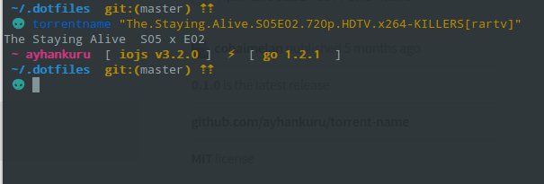

<div align="center">
  <a href="http://github.com/fish-shell/wahoo">
  
  </a>
</div>
<br>

> torrentname for [Wahoo][wahoo].


![][wahoo-badge]
[![][travis-logo]][travis]
![][license-badge]

## Install


```fish
$ wa g torrentname
```


## Usage

```fish
$ torrentname "The.Staying.Alive.S05E02.720p.HDTV.x264-KILLERS[rartv]"
```

## Screenshot




# License

[MIT][mit] © [ayhankuru][author] et [all][contributors] :heart:


[mit]:            http://opensource.org/licenses/MIT
[author]:         http://github.com/ayhankuru
[contributors]:   https://github.com/ayhankuru/torrentname/graphs/contributors
[wahoo]:          https://www.github.com/fish-shell/wahoo
[wahoo-badge]:    https://img.shields.io/badge/Wahoo-Framework-FF2848.svg?style=flat-square
[license-badge]:  https://img.shields.io/badge/license-MIT-444444.svg?style=flat-square
[travis-logo]:    http://img.shields.io/travis/ayhankuru/torrentname.svg?style=flat-square
[travis]:         https://travis-ci.org/ayhankuru/torrentname
