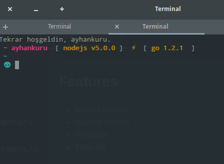
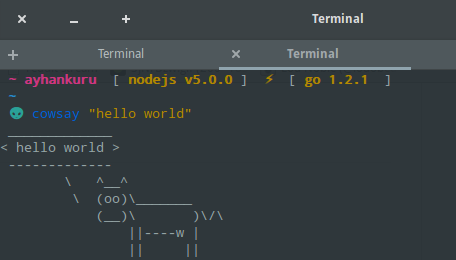

<div align="center">
  <a href="http://github.com/fish-shell/wahoo">
  
  </a>
</div>
<br>

> fscoiety theme for [Wahoo][wahoo].


## Install


```fish
$ wa u fscoiety
```


## Features

+ Nodejs version
+ Golang version
+ Git status
+ ~~Todo list~~


## Screenshot

<p align="center">

</p>

<p align="center">

</p>

<p align="center">

</p>
# License

[MIT][mit] © [ayhankuru][author] et [al][contributors] :heart:


[mit]:            http://opensource.org/licenses/MIT
[author]:         http://github.com/ayhankuru
[contributors]:   https://github.com/ayhankuru/fscoiety/graphs/contributors
[wahoo]:          https://www.github.com/fish-shell/wahoo
[wahoo-badge]:  https://img.shields.io/badge/Wahoo-Framework-FF2848.svg?style=flat-square
[license-badge]:  https://img.shields.io/badge/license-MIT-444444.svg?style=flat-square
